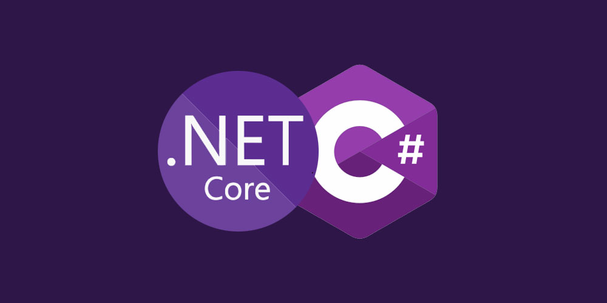

¡Hola, desarrolladores! 👨‍💻

Hoy comenzamos con el clásico **"Hola Mundo" en C#**, el primer paso en cualquier lenguaje.  
Vamos a ver cómo crear un proyecto, escribir el código y ejecutarlo con .NET.



<!-- truncate -->

## Requisitos previos

Necesitas tener instalado:

- [SDK de .NET 8 o superior](https://dotnet.microsoft.com/download)
- Una terminal (Command Prompt, PowerShell, Terminal de VSCode, etc.)

Para verificar que tienes `.NET` instalado:

```bash
dotnet --version
```

---

## Crear el proyecto

Vamos a crear un proyecto de consola:

```bash
dotnet new console -n HelloWorldApp
```

Esto genera una carpeta `HelloWorldApp` con el código base.

---

## Editar el programa

Ve a la carpeta:

```bash
cd HelloWorldApp
```

Edita el archivo `Program.cs` (es el que contiene el código principal).

Puedes dejarlo así:

```csharp title="Program.cs"
using System;

class Program
{
    static void Main(string[] args)
    {
        Console.WriteLine("Hola, mundo!");
    }
}
```

---

## Ejecutar el programa

Para compilar y ejecutar:

```bash
dotnet run
```

Deberías ver en la consola:

```
Hola, mundo!
```

¡Felicidades! Has creado y ejecutado tu primer programa en C#.

---

### 📝 Resumen

✅ Creamos un proyecto con `dotnet new console`
✅ Escribimos el código en `Program.cs`
✅ Ejecutamos con `dotnet run`

---

¡Nos vemos en el próximo artículo! 🚀
